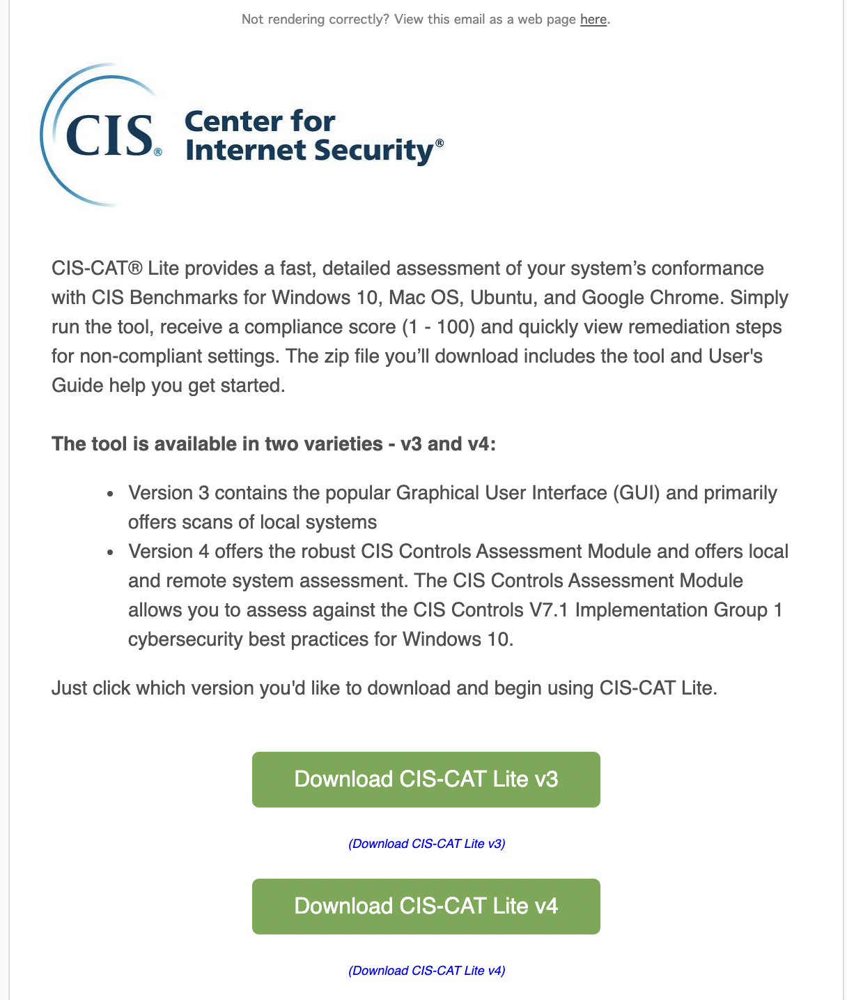

# Run CIS-CAT benchmark in your node

> [CIS-CAT Lite](https://learn.cisecurity.org/cis-cat-lite)is the free assessment tool developed by the CIS (Center for Internet Security, Inc.). CIS-CAT Lite helps users implement secure configurations for multiple technologies. With unlimited scans available via CIS-CAT Lite, your organization can download and start implementing CIS Benchmarks in minutes.

1. Fill out the form and you will receive a CIS-CAT benchmark download link in your email. Inside the email you will find the option to download version 3 or version.

2. Download it to our exercise node. Hover with the mouse over versionv4and copy the link. Then log into your exercise node and usethewgetcommand to retrieve the file.

